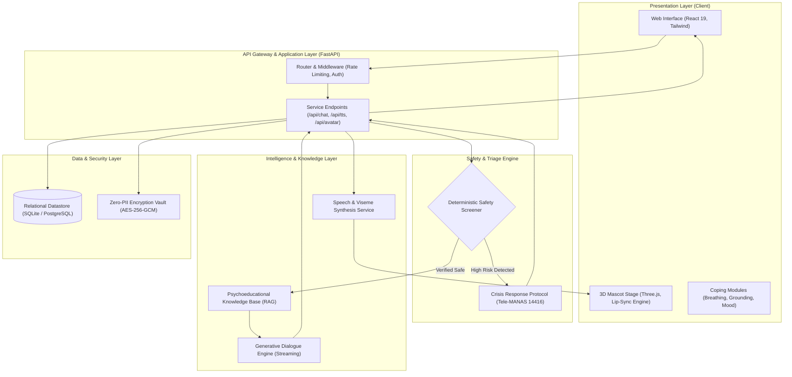

# MANAS: AI Digital Mental Twin & Wellness Companion

> Computational Emotion & Digital Twin Research Initiative  
> Intelligent Systems & Mental Health Computing Laboratory  
> Department of Computer Science & Engineering

[](LICENSE)
[](https://python.org)
[](https://react.dev)
[](https://fastapi.tiangolo.com)
[](https://threejs.org)
[](#privacy-and-security)

---

## Abstract and Overview

MANAS is an intelligent computational platform designed to provide evidence-based emotional wellness support, affective computing interactions, and stress mitigation for students and early-career professionals. The system integrates real-time three-dimensional conversational mascot rendering, deterministic clinical safety guardrails, retrieval-augmented psychoeducational context, and privacy-preserving data management.

### Clinical and Ethical Boundaries
MANAS is engineered strictly as a non-diagnostic, supportive psychoeducational companion. It does not provide medical diagnoses, clinical treatment plans, or prescription counsel. The platform incorporates automated triage protocols that route users expressing acute distress or self-harm intent to accredited national crisis resources, including Tele-MANAS (14416) and National Emergency Services (112).

---

## Core Capabilities

### 1. Real-Time 3D Affective Embodiment
- **Procedural Mascot Rendering**: Developed with Three.js and React Three Fiber, featuring custom toon shading, dynamic rim illumination, and responsive gaze tracking.
- **Phoneme-to-Viseme Lip Synchronization**: Real-time audio frequency decomposition and viseme parameter interpolation for synchronized speech simulation.
- **Modular Wardrobe Pipeline**: Six standardized attire configurations with texture optimization.
- **Graceful Degradation**: Automated fallback to an animated two-dimensional sprite rig for constrained hardware or reduced-motion client preferences.
- **Attribute Extraction**: Server-side vision pipeline for extracting tone and stylistic attributes with zero-retention ephemeral processing.

### 2. Multi-Tier Clinical Safety and Triage
- **Deterministic Pre-Screening**: Inbound messages are screened against safety classifications prior to invoking generative model pipelines.
- **Crisis Intervention Dispatch**: Automated delivery of standardized crisis containment responses linked directly to Tele-MANAS (14416) and KIRAN (1800-599-0019).
- **Prescription Deflection**: Strict boundaries prohibiting pharmaceutical recommendations, routing users to licensed healthcare professionals.

### 3. Multilingual Interaction Support
- Comprehensive localized emotional dialogue support across eight languages:
  - English, Tamil (including Tanglish transliteration), Hindi, Bengali, Kannada, Malayalam, Marathi, and Telugu.
- Linguistically grounded conversational tone designed to avoid negative affective mimicry.

### 4. Interactive Psychoeducational Modules
- **Autonomic Pacing**: Guided 4-7-8 breathing pacer for parasympathetic activation.
- **Sensory Grounding Protocol**: Structured 5-4-3-2-1 cognitive sensory anchoring exercise.
- **Affective Trajectory Monitoring**: Daily longitudinal mood tracking and visualization.
- **Acoustic Calming Engine**: Integrated playback of 432 Hz harmonic soundscapes.

### 5. Privacy-Preserving Architecture
- Alignment with the Digital Personal Data Protection Act (DPDP 2023) and HIPAA technical safeguards.
- AES-256-GCM symmetric encryption for personally identifiable data and emergency contact vectors.
- User-centric sovereignty: full data export and unilateral account and interaction purge capabilities.

---

## System Architecture



### Architectural Flow Summary
1. **Client Interaction**: User text or audio inputs are captured through the React application and transmitted over authenticated HTTP/WebSocket connections.
2. **Deterministic Triage**: All incoming requests are immediately intercepted by the safety screening layer. High-risk inputs bypass generative processing and invoke structured intervention templates.
3. **Contextual Generation**: Safe queries are augmented with vetted psychoeducational literature (CBT exercises, sleep hygiene) before streaming through the conversational engine.
4. **Affective Feedback**: Output tokens drive concurrent speech synthesis and facial blendshape parameterization on the Three.js mascot rig.

---

## Repository Structure

```
├── backend/                       # Python FastAPI Application
│   ├── app/
│   │   ├── main.py                # Server entry point and API route declarations
│   │   ├── database.py            # Database initialization and ORM layer
│   │   ├── safety/                # Clinical screening rules and crisis templates
│   │   └── services/              # Pipeline orchestration, chat engine, and audio services
│   ├── knowledge/                 # Vetted psychoeducational reference guides
│   ├── tests/                     # Unit and integration test suites
│   └── requirements.txt           # Python backend dependencies
│
├── frontend/                      # Client-Side Application (React + Vite + Three.js)
│   ├── src/
│   │   ├── components/            # Interface components (Chat, Avatar, Coping, Audio)
│   │   │   ├── ThreeMascot/       # 3D avatar rig, lighting stage, and lip-sync
│   │   │   ├── chat/              # Dialogue bubbles, waveform monitor, exercise modals
│   │   │   └── music/             # Acoustic therapy drawer and player
│   │   ├── i18n/                  # Localization packs (EN, TA, HI, BN, KN, ML, MR, TE)
│   │   ├── lib/                   # Audio frequency processing, facial tracking, and emotion APIs
│   │   └── pages/                 # Diagnostic and verification views
│   ├── public/                    # 3D binary assets (.glb), textures, and static media
│   └── package.json               # Node.js dependencies and script definitions
│
├── ml/                            # Machine Learning Models and Sidecars
│   ├── emotion/                   # MuRIL emotion classification models and ONNX servers
│   ├── intent/                    # Intent classification datasets and specifications
│   ├── risk/                      # Clinical risk evaluation models and notebooks
│   └── feedback/                  # Clinical verification and active learning pipeline
│
├── eval/                          # Quantitative Evaluation Framework
│   ├── run_eval.py                # Automated testing pipeline against clinical criteria
│   ├── test_cases.json            # Benchmark conversation evaluation scenarios
│   └── rubric.md                  # Clinical empathy and safety evaluation rubric
│
├── scripts/                       # Migration, asset compilation, and verification utilities
├── .env.example                   # Environment configuration template
└── README.md                      # Primary project documentation
```

---

## Installation and Setup

### System Prerequisites
- **Node.js**: Version 18.0.0 or higher
- **Python**: Version 3.10 or higher
- **Package Manager**: `npm` or `pnpm`

---

### Step 1: Clone the Repository

```bash
git clone https://github.com/Sriram-J-CS/MANAS.git
cd MANAS
```

---

### Step 2: Environment Configuration

Create a local `.env` file using the provided template:

```bash
cp .env.example .env
```

Populate the required environment variables:

```env
# AI Model Provider
AI_PROVIDER_API_KEY="your_api_key_here"

# Voice & Speech Synthesis Provider (Optional; defaults to Web SpeechSynthesis)
VOICE_PROVIDER_API_KEY="your_voice_key_here"

# Database Configuration (Optional; defaults to local SQLite)
DATABASE_URL="sqlite:///./manas_twin.db"
AUTH_SECRET="your_secure_random_hex_key"
```

> **Security Advisory**: Credentials and secret keys must remain confidential. The `.gitignore` configuration excludes all `.env` files from version control to prevent credential exposure.

---

### Step 3: Backend Initialization

```bash
cd backend
python -m venv venv

# Windows PowerShell
.\venv\Scripts\activate
# Linux / macOS
source venv/bin/activate

pip install -r requirements.txt
uvicorn app.main:app --reload --port 8000
```

The application programming interface will be available at `http://localhost:8000`.  
Swagger documentation is accessible at `http://localhost:8000/docs`.

---

### Step 4: Frontend Initialization

In a separate terminal session:

```bash
cd frontend
npm install
npm run dev
```

The web application client will be accessible at `http://localhost:5173`.

---

## Verification and Testing

Execute the automated test suites to validate safety mechanisms and conversational pipelines:

```bash
# Execute backend unit and safety regression tests
cd backend
pytest tests/

# Execute clinical dialogue benchmark evaluation
python ../eval/run_eval.py
```

---

## Clinical Safety Protocol

The platform implements a deterministic triage matrix:

| Condition | System Response | Intervention Channel |
| :--- | :--- | :--- |
| **Severe Distress / Crisis Expression** | Halts generative synthesis; provides immediate helpline contact | Standardized clinical template |
| **Medical / Drug Inquiries** | Deflects diagnostic advice; directs user to licensed physicians | Standardized medical disclaimer |
| **Standard Affective Support** | Integrates relevant psychoeducational context and generates empathetic response | RAG + Generative Engine |
| **Acute Anxiety / Agitation** | Suggests autonomic regulation modules (breathing or grounding) | Interactive coping widgets |

### Accredited Crisis Contacts (India)
- **Tele-MANAS**: `14416` (Toll-Free, 24/7)
- **National Emergency Response**: `112`
- **KIRAN Helpline**: `1800-599-0019`

---

## License

This project is licensed under the [MIT License](LICENSE).

---

## Acknowledgments and Citations

Conducted under the research direction of the **Intelligent Systems & Mental Health Computing Laboratory**, Department of Computer Science & Engineering. We express gratitude to the contributing clinicians, counselors, and open-source researchers whose expertise informed the development of our safety protocols and conversational boundaries.
