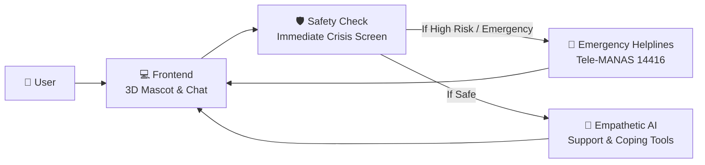

# MANAS — AI Digital Mental Twin & Wellness Companion

> **MANAS TWIN** · Computational Emotion & Digital Twin Research  
> Intelligent Systems & Mental Health Computing Lab, Department of Computer Science & Engineering

[](LICENSE)
[](https://python.org)
[](https://react.dev)
[](https://fastapi.tiangolo.com)
[](https://threejs.org)
[](#safety--crisis-guardrails)

---

## 🌟 Overview

**MANAS** is an AI-powered digital mental twin and wellness companion designed specifically for students and young working professionals facing academic pressure, burnout, loneliness, and emotional distress. It combines real-time 3D interactive mascot animations with empathetic conversational AI, vetted cognitive-behavioral coping exercises, and multi-tier clinical safety guardrails.

> ⚠️ **Important Medical Disclaimer**: MANAS is a supportive emotional wellness and psychoeducational companion. It does **not** provide clinical diagnosis, psychiatric treatment, or medical prescriptions. For acute emergencies or crisis situations, MANAS automatically routes users to national toll-free support helplines including **Tele-MANAS (14416)** and **Emergency Services (112)**.

---

## 🎯 Key Features

### 1. 🎭 Real-Time 3D Cartoon Mascot
- Interactive 3D avatar built with **Three.js** and **React Three Fiber**.
- Features toon-shading, soft rim lighting, natural breathing loops, head tracking, and real-time facial blendshapes (`viseme_aa`, `smile`, `blink`, `concerned`, `browInnerUp`).
- Real-time audio lip-sync driven by Web Audio API frequency analysis and viseme timestamps.
- **Customizable Wardrobe**: Six distinct attire styles (Hoodie, Formal, Kurta/Saree, Sports, Pyjamas, Festive).
- **Graceful 2D Fallback**: Lightweight animated portrait for low-power devices and reduced-motion preferences.
- **Privacy-First Photo Personalization**: Free vision-based attribute extraction (skin tone, hair color, glasses) with **immediate photo purging** from memory.

### 2. 🛡️ Dual-Tier Crisis Safety & Triage
- **Deterministic Rule Screening**: Messages are evaluated by safety guardrails *before* invoking generative models.
- **Crisis Response Protocol**: High-risk expressions immediately trigger empathetic, vetted crisis intervention messages with direct links to Tele-MANAS (14416) and KIRAN (1800-599-0019).
- **Medication Guardrails**: Automatic deflection of prescription requests with guidance to consult certified medical professionals.

### 3. 🌐 Multilingual & Culturally Grounded
- Natural communication support across 8 Indian languages:
  - **English**, **Tamil** (including Tanglish), **Hindi**, **Bengali**, **Kannada**, **Malayalam**, **Marathi**, and **Telugu**.
- Localized coping phrases, culturally empathetic tone, and context-aware responses.

### 4. 🧘 Interactive Coping & Calming Tools
- **Guided 4-7-8 Breathing**: Synchronized animated visual pacer for nervous system downregulation.
- **5-4-3-2-1 Sensory Grounding**: Step-by-step interactive grounding sequence for anxiety and panic.
- **Mood Journey & Tracking**: Daily emotional check-in with 7-day trend visualizations.
- **Binaural Calming Audio**: Integrated player featuring 432 Hz Solfeggio healing soundscapes and ambient tracks.

### 5. 🔒 Zero-PII & Privacy Architecture
- Designed in compliance with **DPDP 2023** and **HIPAA** security standards.
- AES-256-GCM field-level encryption for user contacts and emergency data.
- Granular consent management: Users can review, export, or permanently purge their data at any time.

---

## 🏗️ How It Works (Simple Architecture)



### In 3 Simple Steps:
1. **Interactive Experience**: You talk or type to the animated 3D companion in your browser.
2. **Safety First**: Every message is instantly checked for crisis keywords. If someone is in distress, the system immediately shows emergency helpline numbers (Tele-MANAS 14416).
3. **Empathetic Support**: If safe, the AI responds with warm, supportive conversation, guided breathing, and grounding exercises.


---

## 📂 Repository Structure

```
├── backend/                       # Python FastAPI Backend
│   ├── app/
│   │   ├── main.py                # Core API routes (/api/chat, /api/tts, /api/avatar)
│   │   ├── database.py            # SQLite schema initialization & database access
│   │   ├── safety/                # Crisis rules & clinical templates
│   │   └── services/              # Chat engine, LLM integration, RAG, and voice
│   ├── knowledge/                 # Vetted psychoeducational markdown guides
│   ├── tests/                     # Pipeline & safety unit tests
│   └── requirements.txt           # Python dependencies
│
├── frontend/                      # React + Vite + Three.js Application
│   ├── src/
│   │   ├── components/            # UI components (Chat, Avatar, Coping, Music)
│   │   │   ├── ThreeMascot/       # 3D cartoon avatar, stage, wardrobe, lip-sync
│   │   │   ├── chat/              # Chat bubbles, waveforms, breathing & grounding
│   │   │   └── music/             # Calming ambient music drawer & mini player
│   │   ├── i18n/                  # Multi-language translation packs (EN, TA, HI, etc.)
│   │   ├── lib/                   # Audio analysis, face tracking, emotion services
│   │   └── pages/                 # Testing & developer verification playgrounds
│   ├── public/                    # Avatar 3D models (.glb), icons, and assets
│   └── package.json               # Frontend dependencies & scripts
│
├── ml/                            # Machine Learning & Emotion Sidecars
│   ├── emotion/                   # MuRIL emotion classifier training & ONNX server
│   ├── intent/                    # Intent classification dataset & model cards
│   ├── risk/                      # Risk assessment models & training notebooks
│   └── feedback/                  # Clinical review export & active learning loop
│
├── eval/                          # Rigorous Evaluation Harness
│   ├── run_eval.py                # Automated evaluation against clinical test suites
│   ├── test_cases.json            # 200+ test scenarios across emotional states
│   └── rubric.md                  # Clinical empathy & safety scoring criteria
│
├── scripts/                       # Migration, asset pack, and QA scripts
├── .env.example                   # Secure template for environment variables
└── README.md                      # Project documentation
```

---

## 🚀 Getting Started

### Prerequisites
- **Node.js**: `v18.0.0` or higher
- **Python**: `v3.10` or higher
- **npm** or **pnpm**

---

### Step 1: Clone the Repository

```bash
git clone https://github.com/Sriram-J-CS/MANAS.git
cd MANAS
```

---

### Step 2: Configure Environment Variables

Copy `.env.example` to create your local `.env` file:

```bash
cp .env.example .env
```

Populate the required credentials in `.env`:

```env
# AI Engine
AI_PROVIDER_API_KEY="your-api-key"

# Voice & Speech (Optional; falls back to browser SpeechSynthesis)
VOICE_PROVIDER_API_KEY="your-voice-key"

# Optional Cloud Services
DATABASE_URL="sqlite:///./manas_twin.db"
AUTH_SECRET="your-32-byte-secret"
```

> 🔒 **Security Notice**: Never commit `.env` or real API keys to version control. The repository includes strict `.gitignore` rules to prevent credential leakage.

---

### Step 3: Run the Backend

```bash
cd backend
python -m venv venv

# Windows
.\venv\Scripts\activate
# Linux/macOS
source venv/bin/activate

pip install -r requirements.txt
uvicorn app.main:app --reload --port 8000
```

The backend API will start at `http://localhost:8000`.  
Interactive documentation is accessible at `http://localhost:8000/docs`.

---

### Step 4: Run the Frontend

Open a new terminal tab:

```bash
cd frontend
npm install
npm run dev
```

The application will be running at `http://localhost:5173`.

---

## 🧪 Testing & Evaluation

To run the automated safety and conversation test suite:

```bash
# Run backend safety and pipeline tests
cd backend
pytest tests/

# Run the 200-scenario clinical evaluation suite
python ../eval/run_eval.py
```

---

## 🛡️ Safety & Crisis Guardrails

MANAS follows a strict **Safety-First** architecture:

| Scenario | System Action | Response Source |
| :--- | :--- | :--- |
| **Self-Harm / Crisis Intent** | Intercepts turn immediately; provides emergency numbers | Deterministic clinical template |
| **Medical / Drug Advice Request** | Rebuffs prescription advice; recommends consulting a doctor | Deterministic medical template |
| **Normal Emotional Support** | Retrieves psychoeducational context & streams empathetic reply | Streaming LLM + RAG |
| **Panic / Acute Stress** | Offers 4-7-8 breathing or 5-4-3-2-1 grounding exercises | Interactive Coping Widgets |

### Emergency Helplines (India)
- **Tele-MANAS**: `14416` (Toll-Free, 24/7)
- **National Emergency Number**: `112`
- **KIRAN Mental Health Helpline**: `1800-599-0019`

---

## 📜 License

This project is licensed under the [MIT License](LICENSE).

---

## 🤝 Acknowledgments

Developed under the **Computational Emotion & Digital Twin Research Initiative**, Department of Computer Science & Engineering. Grateful acknowledgment to the open-source community and mental health professionals for their invaluable feedback and clinical guidance.
