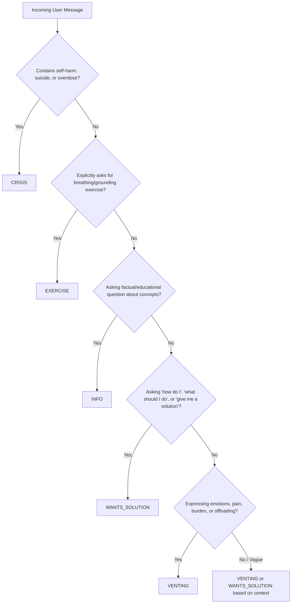

# MANAS Intent Classification Labeling Guide

This guide establishes the clinical, conversational, and operational taxonomy for classifying user messages into five core intents for the MANAS mental health chatbot:
1. `venting`
2. `wants_solution`
3. `exercise`
4. `info`
5. `crisis`

---

## 1. Intent Definitions & Decision Boundaries

### 1. `venting`
- **Definition**: The user is sharing feelings, offloading emotional distress, or describing a painful or frustrating situation without requesting immediate advice, steps, or fixes.
- **Underlying Need**: To be heard, validated, and emotionally held without premature problem-solving.
- **Readiness**: Not ready for action or advice.
- **Indicators**:
  - Descriptions of sadness, fatigue, crying, feeling overwhelmed, unfair treatment, loneliness.
  - Statements like *"I just feel like crying"*, *"everything feels so heavy"*, *"I can't take this"*, *"nobody listens to me"*, *"just wanted to say this"*.
  - Use of emotional words without question marks or direct problem-solving requests.
- **Golden Examples**:
  - *"I'm so exhausted, I had a terrible day and my head hurts."*
  - *"It feels like no matter how hard I try, things just fall apart."*
  - *"naan romba tired aa irukken, manasu valikithu."*
  - *"आज दिन बहुत खराब था, किसी से बात करने की हिम्मत नहीं है।"*

### 2. `wants_solution`
- **Definition**: The user is explicitly or implicitly seeking actionable guidance, practical steps, perspective, or a solution to resolve a problem or dilemma.
- **Underlying Need**: Actionable clarity, a small next step, cognitive reframe, or a strategy.
- **Readiness**: Ready for insight or small concrete actions.
- **Indicators**:
  - Direct questions: *"What should I do?"*, *"How do I fix this?"*, *"Give me a solution"*, *"Answer me"*.
  - Practical dilemmas: *"How can I talk to my professor about my attendance?"*, *"How do I manage time between coaching and college?"*.
  - Inquiries on how to overcome procrastination, boundary setting, sleep habits.
- **Golden Examples**:
  - *"give me a solution, how do I fix my sleep?"*
  - *"What should I do when my boss assigns impossible deadlines?"*
  - *"How can I start studying when I feel paralyzed by my syllabus?"*
  - *"enakku solution sollu, epdi time manage panrathu?"*

### 3. `exercise`
- **Definition**: The user is explicitly requesting a somatic, grounding, mindfulness, or breathing technique to regulate their autonomic nervous system.
- **Underlying Need**: Somatic grounding, physical calm, guided breathing, physiological regulation.
- **Indicators**:
  - Explicit requests for exercises: *"Can we do breathing?"*, *"Guide me through 4-7-8"*, *"Help me ground myself"*, *"Do you have a grounding exercise?"*.
  - Requests for physical relaxation: *"Guide my breath"*, *"Let's do 5-4-3-2-1"*.
- **Distinction from `wants_solution`**: If user asks *"How do I sleep?"*, that is `wants_solution`. Only classify as `exercise` if they ask for a technique, somatic exercise, or breathing practice.
- **Golden Examples**:
  - *"Can you guide me through a 4-7-8 breathing exercise?"*
  - *"I need a grounding technique right now."*
  - *"Teach me how to do box breathing."*
  - *"மூச்சுப் பயிற்சி ஏதாவது சொல்லிக் கொடுங்க."*

### 4. `info`
- **Definition**: The user is asking an educational, factual, or conceptual question regarding mental health, psychology, neuroscience, or coping terminology.
- **Underlying Need**: Psychoeducation, intellectual clarity, understanding symptoms or mechanisms.
- **Indicators**:
  - Factual questions: *"What is the difference between panic and anxiety?"*, *"What does somatic mean?"*, *"Why do people experience brain fog?"*, *"How does cortisol affect sleep?"*.
- **Golden Examples**:
  - *"What is a cognitive distortion?"*
  - *"Can you explain the fight-or-flight response?"*
  - *"What is burnout compared to regular tiredness?"*
  - *"அறிவாற்றல் விலகல் என்றால் என்ன?"*

### 5. `crisis`
- **Definition**: The user is expressing explicit or implicit thoughts of suicide, self-harm, severe hopelessness, or dangerous behavior (e.g. pill overdose).
- **Underlying Need**: Immediate emergency crisis intervention, human safety connection, verified helplines (Tele-MANAS 14416).
- **Indicators**:
  - *"want to die"*, *"kill myself"*, *"end it all"*, *"better off dead"*, *"swallowed pills"*, *"cutting myself"*, *"tharkolai"*, *"aatmahatya"*.
- **Safety Priority**: Any message meeting crisis criteria MUST be classified as `crisis` regardless of any other questions in the text.
- **Golden Examples**:
  - *"I want to die, I can't take this anymore."*
  - *"I'm going to swallow all my sleeping pills tonight."*
  - *"naan sethudalam nu mudivu panniten."*
  - *"मुझे जीना नहीं है, सब खत्म करना है।"*

---

## 2. Decision Tree for Disambiguation

---

## 3. Ambiguous Edge Cases & Guidelines

1. **"I can't sleep, what do I do?"**
   - **Label**: `wants_solution`
   - **Rationale**: User is asking for a practical course of action ("what do I do?"). Do NOT label as `exercise` unless they say "give me a breathing exercise to sleep".
2. **"Help me untangle what feels heaviest"**
   - **Label**: `venting`
   - **Rationale**: User is expressing an overwhelming emotional tangle and asking for companionship in untangling. Rushing to solutions here would violate clinical attunement.
3. **"I feel like ending it all, but can you give me one reason to stay?"**
   - **Label**: `crisis`
   - **Rationale**: Any suicidal phrase ("ending it all") elevates the intent directly to `crisis`.
4. **"Does 4-7-8 breathing actually work?"**
   - **Label**: `info`
   - **Rationale**: Factual question about efficacy, not a request to perform the exercise right now.
